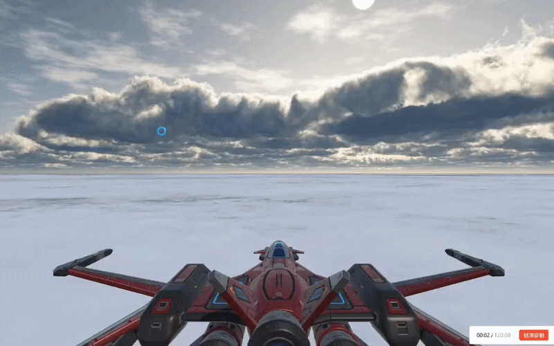

# Space War

## Game Introduction

**Space War** is a 3D space shooting game made with Unity.

The player controls a spaceship in space, avoids enemy spaceships flying toward them, and shoots bullets to destroy enemies.

When a bullet hits an enemy, the enemy will be destroyed.  
When an enemy collides with the player’s spaceship, the game ends and the screen pauses.

---

## Controls

| Key / Input | Function |
|---|---|
| **W / S** or **↑ / ↓** | Move the spaceship up and down |
| **A / D** or **← / →** | Move the spaceship left and right |
| **Space** | Shoot bullets |

---

## Game Design

This game is made with Unity. The main functions are created with C# scripts, including:

- Player control
- Bullet shooting
- Enemy spawning
- Enemy movement
- Collision detection
- Game over logic

The project uses spaceship models and a space background, so the visual style feels like a sci-fi space battle.

---

## Main Scripts

The main gameplay systems are built with scripts under the `Assets/Scripts` folder.

---

### PlayerControl.cs

`PlayerControl.cs` controls the player spaceship’s movement and shooting.

It uses Unity’s:

```csharp
Input.GetAxis
